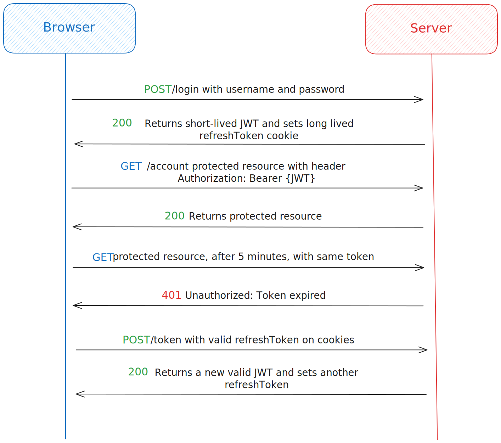

# Authentication Boilerplate Monorepo

A starting point for custom authentication without magic libraries. This monorepo provides:

- A **Fastify API** using JWT refresh tokens, accepting credentials via the `Authorization` header or a `token` cookie.
- A **Next.js 14 Frontend** with server/client authentication, middleware revalidation, and Axios interceptors.
- Shared [Zod](https://zod.dev) schemas via the `@repo/schemas` package.
- Turborepo for local package sharing and scripting.

### Powered by:


## API

Built with [Fastify](https://www.fastify.io), the API handles auth using:

- **Type Validation:** [Zod](https://zod.dev)
- **ORM:** [Drizzle](https://orm.drizzle.team) with [PostgreSQL](https://www.postgresql.org)
- **Mailing:** [Resend](https://resend.com) & [React Email](https://react.email)
- **Encryption:** [bcrypt](https://www.npmjs.com/package/bcrypt)
- **Caching:** [Redis](https://redis.io)

Documentation is available on the following API routes:

- [Scalar UI](https://scalar-ui.com) for a modern interface at `/docs`
- [Swagger](https://swagger.io) for the classic one at `/reference`

## Frontend

The frontend leverages [Next.js 14](https://nextjs.org) for seamless server/client authentication, with revalidation in middleware and auth interceptors powered by [Axios](https://axios-http.com).

## Authentication Flow

Users authenticate via JWT refresh tokens. Supported actions include:

- Password reset (authenticated and "forgot password")
- Email confirmation before signup
- Account deletion
- Display name updates



## Setup

Begin by configuring your environment. Rename and update the provided `.env.example` files:

- **Global secrets:** [.env.example](.env.example) for DB, Redis, etc.
- **API secrets:** [apps/server/.env.example](apps/server/.env.example) for JWT signing keys and API keys.
- **Next.js variables:** [apps/web/.env.example](apps/web/.env.example).

Next, spin up your Postgres and Redis databases with Docker Compose:

```sh
docker compose up
```

Install dependencies and run database migrations:

```sh
npm install
npm run migrate
```

Finally, start the development server:

```sh
npm run dev
```

## Customization

Every aspect of this boilerplate can be customized to fit your needs. For example, you can:

- Customize the `APP_NAME` in [packages/constants/src/app.ts](packages/constants/src/app.ts) which will be used in mailing, docs and some UI components.
- Change the "Logo" to anything you like
    - Web logo in: [apps/web/public/logo.svg](apps/web/public/logo.svg)
    - Server logos in: [apps/server/src/public/logo.png](apps/server/src/public/logo.png) and [apps/server/src/public/favicon.svg](apps/server/src/public/favicon.svg)
        > Logos won't load on emails on development server because email clients can't access your localhost. On the production server, they will work fine.
- Customize every aspect of the UI Components in the [apps/web/components](apps/web/components) directory ([https://ui.shadcn.com/](shadcn/ui) btw).
- Customize the mailing templates in the [apps/server/src/emails](apps/server/src/emails) directory using [https://react.email/](React Email).
- Change docs theme and colors in the [apps/server/src/server.ts](apps/server/src/server.ts) file according to [https://github.com/scalar/scalar/blob/82c8f39c5f390ced5d8406bfb0b23623575fb85e/documentation/themes.md](Scalar UI themes).
